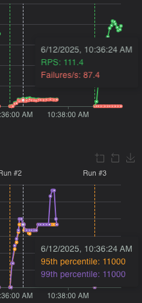
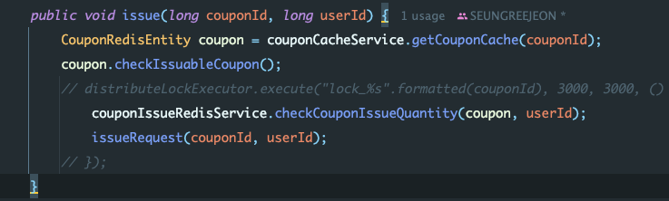
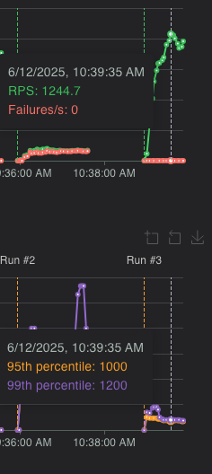
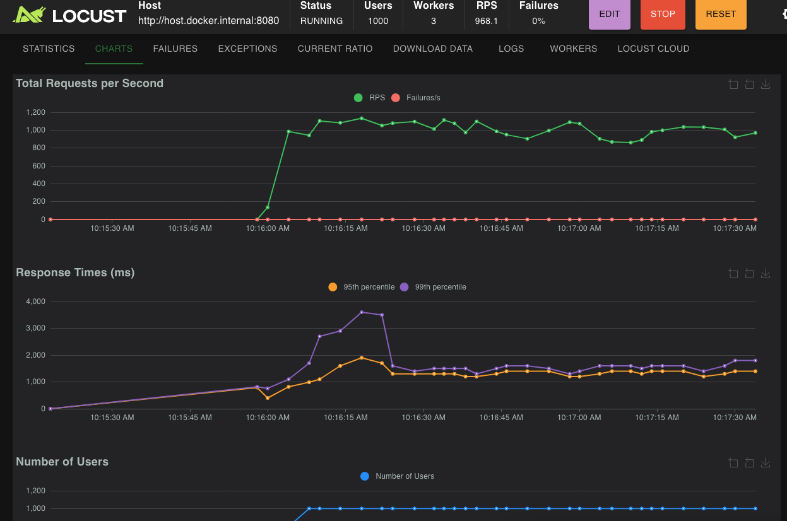

# 🎟️ CouponSite
**선착순 쿠폰 발급 시스템**

---

## 📌 Background
네고왕 선착순 쿠폰 이벤트는 **한정 수량**의 쿠폰을 먼저 신청한 사용자에게 제공하는 이벤트입니다.

---

## ✅ Requirements

- 📆 이벤트 기간 내에만 발급 가능  
  _예: `2023-11-03 13:00 ~ 2023-11-04 13:00`_
- 👤 사용자당 1회만 발급 가능
- 🎯 최대 발급 수량 설정 가능

---

## 🏗 Architecture

### ⚙️ 비동기 쿠폰 발급 요청 처리 구조
1. 유저 요청 → API Server
2. API Server → Redis에 발급 요청 저장
3. 발급 Server가 Redis에서 큐를 Pull
4. 발급 처리 후 MySQL에 트랜잭션 저장

---

## 🛠 Tech Stack

### ☁ Infra
- AWS EC2
- AWS RDS
- AWS Elastic Cache

### 🖥 Server
- Java 17
- Spring Boot 3.1
- Spring MVC
- JPA, QueryDSL

### 💾 Database
- MySQL
- Redis
- H2 (테스트용)

### 📈 Monitoring
- AWS CloudWatch
- Spring Actuator
- Prometheus
- Grafana

### 🧪 Etc
- Locust (부하 테스트)
- Gradle
- Docker

---

## 🌟 Main Features

- ✅ 쿠폰 발급 검증
    - ⏰ 발급 기한 확인
    - 📦 발급 수량 제한
    - 🚫 중복 발급 차단

- 🧮 Redis 기반 수량 관리
    - `Redis Set`으로 재고 관리
    - `Redis List` 큐 기반 비동기 발급 처리
    - 스케줄러를 이용한 `Queue Polling`

---

## 🖨️ 각 테스트별 결과

테스트 사양 : 인텔 맥 i9세대

### 1. 레디스 분산락 RPS



결과 분석 : 

실패나는 이유는 레디스 락에 타임아웃이 3초이기 때문이다.

초당 1000의 요청인데 초당 100의 요청만 처리하기때문에 점점 누적되어 3초뒤부터는 에러가 발생한다.
### 2. 레디스 언락시 RPS

동시성을 고려하지 않고 락을 해제하고 테스트







결과 분석 :

락을 거는 경우 초당 100 RPS였지만 락을 해제 후 1000을 감당할 수 있게 되었다.

### 3. 레디스 스크립트 사용 RPS



결과 분석 :

레디스에 키존재여부,남은 수량을 락을걸고 묻지 않도록한다.

락을 사용하지않고 싱글 스레드 기반의 레디스에서 한번에 쿠폰 발급 여부, 남은 수량을 체크해서 발급까지 하도록 스크립트 기반으로 설정하여 요청한 1000을 감당

이전처럼 락을 걸고 여러번 레디스에 질의하는 네트워크 비용과 다른 스레드의 대기시간을 없애 동시성 보장과 RPS를 유지할 수 있었다.

---
## 🚀 실행 방법 (옵션)

```bash
# 1. Docker 실행
$ docker-compose up

# 2. Gradle 빌드
$ ./gradlew build
